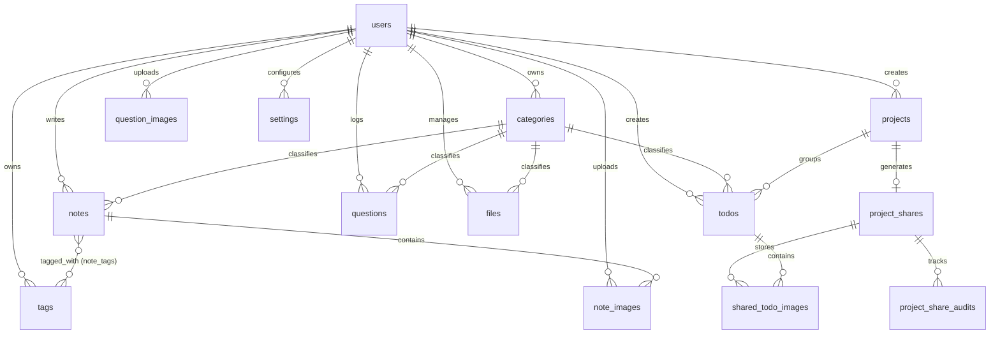

# 專案程式架構、資料庫結構與 API 通訊說明文件

本文件詳細記錄「個人學習與工作管理系統」 (Personal Learning & Workspace) 的軟體架構、資料庫設計（含實體關係圖）以及所有 API 的通訊介面規格。

---

## 一、 程式架構 (Program Architecture)

本專案採用 **Flask** 框架搭配 **Flask-SQLAlchemy** (ORM) 進行開發，並使用 **Flask-Login** 管理帳號狀態。專案的組織架構如下：

### 1. 專案目錄結構

```text
.
├── app/                      # Flask 應用程式核心包
│   ├── routes/               # 路由層 (Web 頁面渲染與 API 介面)
│   │   ├── __init__.py       # 初始化 routes
│   │   ├── api.py            # 核心 CRUD 與搜尋 API 路由
│   │   ├── auth.py           # 使用者登入/登出驗證路由
│   │   ├── pages.py          # 主要前端 Web 頁面渲染路由
│   │   └── shared.py         # 外部免登入專案分享看板路由
│   ├── static/               # 靜態資源 (CSS 樣式表、JS 腳本、圖標等)
│   ├── templates/            # Jinja2 模板 (前端 HTML 介面)
│   ├── __init__.py           # Flask App Factory (應用程式工廠與初始化)
│   ├── cli.py                # 自訂 Flask CLI 指令集
│   ├── config.py             # 應用程式靜態參數與限制設定
│   ├── image_utils.py        # 圖片轉換與壓縮工具 (WebP 格式化)
│   └── models.py             # SQLAlchemy 資料庫模型 (ORM)
├── uploads/                  # 使用者上傳之實體檔案儲存區 (排除於 Git 之外)
│   ├── note_images/          # 學習筆記圖片附件
│   ├── question_images/      # 問題池圖片附件
│   ├── shared_projects/      # 分享看板圖片附件
│   └── user_<id>/            # 使用者檔案管理上傳檔案
├── personal_learning_workspace_app.py  # 生產環境掛載入口 (WSGI)
├── run.py                    # 本機開發啟動入口
├── start_app.bat             # 一鍵啟動批次檔 (自動安裝依賴與初始化資料庫)
├── requirements.txt          # Python 依賴清單
├── DEPLOY_PYTHONANYWHERE.md  # 雲端部署手冊
└── README.md                 # 專案概覽說明
```

### 2. 核心模組與初始化流程

*   **App Factory 模式：** 
    於 [app/\_\_init\_\_.py](file:///C:/Users/leeyiya/Documents/ipy_with_dataana/30.Personal%20Learning%20&%20Workspace/app/__init__.py) 的 `create_app()` 中載入 [Config](file:///C:/Users/leeyiya/Documents/ipy_with_dataana/30.Personal%20Learning%20&%20Workspace/app/config.py) 設定，並綁定資料庫、設定 `LoginManager`。同時在此註冊了四大路由模組（Blueprints）以及自訂 CLI 命令。
*   **自訂 CLI 指令 ([app/cli.py](file:///C:/Users/leeyiya/Documents/ipy_with_dataana/30.Personal%20Learning%20&%20Workspace/app/cli.py))：**
    *   `flask init-db`：全新建立資料庫結構。
    *   `flask upgrade-db`：自動檢測並動態變更既有資料庫之欄位（如動態為舊資料庫新增專案分享與圖片附件欄位）。
    *   `flask seed-basic`：僅生成預設的管理員帳號（`admin / admin123`）與基本分類。
    *   `flask seed`：生成管理員帳號、基本分類、專案，並自動填充各項功能（筆記、工作、問題）的示範資料。
*   **圖片最佳化工具 ([app/image_utils.py](file:///C:/Users/leeyiya/Documents/ipy_with_dataana/30.Personal%20Learning%20&%20Workspace/app/image_utils.py))：**
    使用 Pillow 庫對貼圖與上傳之附件圖片進行壓縮。功能包含自動辨識旋轉資訊（EXIF 轉置）、動態縮放最長邊（最高1600px），並逐步調降 WebP 品質直到檔案大小小於限制（500KB），有效節省 SQLite 資料庫與主機的空間。

---

## 二、 資料庫結構 (Database Structure)

系統使用 SQLite 資料庫（於本機生成為 `workspace.db`）。利用 Flask-SQLAlchemy 宣告 ORM 模型。

### 1. 實體關係圖 (ER Diagram)

以下是資料庫各表單（Entity）與其關聯的 Mermaid ER 圖：



### 2. 資料表詳細欄位定義

#### 2.1 使用者表 ([User](file:///C:/Users/leeyiya/Documents/ipy_with_dataana/30.Personal%20Learning%20&%20Workspace/app/models.py#L20))
*   **資料表名稱：** `users`
*   **用途：** 記錄系統註冊使用者資訊，區分管理員與一般帳號。

| 欄位名稱 | 資料類型 | 主鍵/外鍵 | 允許空值 | 預設值 | 說明 |
| :--- | :--- | :--- | :--- | :--- | :--- |
| `id` | INTEGER | Primary Key | 否 | - | 使用者唯一識別 ID |
| `username` | VARCHAR(80) | - | 否 | - | 登入帳號（具 Unique 索引） |
| `display_name` | VARCHAR(120) | - | 否 | - | 使用者顯示名稱 |
| `password_hash` | VARCHAR(255) | - | 否 | - | 雜湊後密碼密文 |
| `is_admin` | BOOLEAN | - | 否 | `False` | 是否為系統管理員 |
| `is_active_flag`| BOOLEAN | - | 否 | `True` | 帳號啟用狀態（停用者無法登入）|
| `created_at` | DATETIME | - | 否 | UTC 現在時間 | 帳號建立時間 |
| `updated_at` | DATETIME | - | 否 | UTC 現在時間 | 資料更新時間 |

#### 2.2 分類表 ([Category](file:///C:/Users/leeyiya/Documents/ipy_with_dataana/30.Personal%20Learning%20&%20Workspace/app/models.py#L45))
*   **資料表名稱：** `categories`
*   **約束：** `user_id` + `name` 具有複合唯一索引限制（每個使用者不可建立同名分類）。

| 欄位名稱 | 資料類型 | 主鍵/外鍵 | 允許空值 | 預設值 | 說明 |
| :--- | :--- | :--- | :--- | :--- | :--- |
| `id` | INTEGER | Primary Key | 否 | - | 分類唯一識別 ID |
| `user_id` | INTEGER | Foreign Key | 否 | - | 關聯的 [User](file:///C:/Users/leeyiya/Documents/ipy_with_dataana/30.Personal%20Learning%20&%20Workspace/app/models.py#L20).id |
| `name` | VARCHAR(80) | - | 否 | - | 分類名稱 |
| `color` | VARCHAR(20) | - | 否 | `#3b82f6` | 標籤代表色 (十六進制碼) |
| `created_at` | DATETIME | - | 否 | UTC 現在時間 | 分類建立時間 |

#### 2.3 標籤表 ([Tag](file:///C:/Users/leeyiya/Documents/ipy_with_dataana/30.Personal%20Learning%20&%20Workspace/app/models.py#L59))
*   **資料表名稱：** `tags`
*   **約束：** `user_id` + `name` 具有複合唯一索引限制。

| 欄位名稱 | 資料類型 | 主鍵/外鍵 | 允許空值 | 預設值 | 說明 |
| :--- | :--- | :--- | :--- | :--- | :--- |
| `id` | INTEGER | Primary Key | 否 | - | 標籤唯一識別 ID |
| `user_id` | INTEGER | Foreign Key | 否 | - | 關聯的 [User](file:///C:/Users/leeyiya/Documents/ipy_with_dataana/30.Personal%20Learning%20&%20Workspace/app/models.py#L20).id |
| `name` | VARCHAR(80) | - | 否 | - | 標籤名稱 |
| `created_at` | DATETIME | - | 否 | UTC 現在時間 | 標籤建立時間 |

#### 2.4 筆記表 ([Note](file:///C:/Users/leeyiya/Documents/ipy_with_dataana/30.Personal%20Learning%20&%20Workspace/app/models.py#L72))
*   **資料表名稱：** `notes`
*   **關聯：** 
    *   與 `Tag` 透過 [note_tags](file:///C:/Users/leeyiya/Documents/ipy_with_dataana/30.Personal%20Learning%20&%20Workspace/app/models.py#L13) 中介表建立多對多關聯。
    *   與 `NoteImage` 建立一對多關聯（級聯刪除）。

| 欄位名稱 | 資料類型 | 主鍵/外鍵 | 允許空值 | 預設值 | 說明 |
| :--- | :--- | :--- | :--- | :--- | :--- |
| `id` | INTEGER | Primary Key | 否 | - | 筆記唯一識別 ID |
| `user_id` | INTEGER | Foreign Key | 否 | - | 關聯的 [User](file:///C:/Users/leeyiya/Documents/ipy_with_dataana/30.Personal%20Learning%20&%20Workspace/app/models.py#L20).id |
| `category_id` | INTEGER | Foreign Key | 是 | NULL | 關聯的 [Category](file:///C:/Users/leeyiya/Documents/ipy_with_dataana/30.Personal%20Learning%20&%20Workspace/app/models.py#L45).id |
| `title` | VARCHAR(200)| - | 否 | - | 筆記標題 |
| `markdown_content`| TEXT | - | 否 | `""` | Markdown 格式筆記內容 |
| `is_favorite` | BOOLEAN | - | 否 | `False` | 是否收藏 |
| `created_at` | DATETIME | - | 否 | UTC 現在時間 | 筆記建立時間 |
| `updated_at` | DATETIME | - | 否 | UTC 現在時間 | 筆記更新時間 |

#### 2.5 待辦事項表 ([Todo](file:///C:/Users/leeyiya/Documents/ipy_with_dataana/30.Personal%20Learning%20&%20Workspace/app/models.py#L119))
*   **資料表名稱：** `todos`

| 欄位名稱 | 資料類型 | 主鍵/外鍵 | 允許空值 | 預設值 | 說明 |
| :--- | :--- | :--- | :--- | :--- | :--- |
| `id` | INTEGER | Primary Key | 否 | - | 待辦唯一識別 ID |
| `user_id` | INTEGER | Foreign Key | 否 | - | 關聯的 [User](file:///C:/Users/leeyiya/Documents/ipy_with_dataana/30.Personal%20Learning%20&%20Workspace/app/models.py#L20).id |
| `category_id` | INTEGER | Foreign Key | 是 | NULL | 關聯的 [Category](file:///C:/Users/leeyiya/Documents/ipy_with_dataana/30.Personal%20Learning%20&%20Workspace/app/models.py#L45).id |
| `project_id` | INTEGER | Foreign Key | 是 | NULL | 關聯的 [Project](file:///C:/Users/leeyiya/Documents/ipy_with_dataana/30.Personal%20Learning%20&%20Workspace/app/models.py#L150).id |
| `title` | VARCHAR(500)| - | 否 | - | 待辦主旨 |
| `created_by_name`| VARCHAR(80)| - | 是 | NULL | 建立者顯示名稱 (一般使用者或分享看板訪客暱稱) |
| `description` | TEXT | - | 否 | `""` | 詳細說明描述 (支援 Markdown) |
| `priority` | VARCHAR(20) | - | 否 | `Medium` | 優先級 (`High` / `Medium` / `Low`) |
| `status` | VARCHAR(20) | - | 否 | `Todo` | 狀態 (`Todo` / `Doing` / `Done` / `Cancel`) |
| `sort_order` | INTEGER | - | 否 | `0` | 看板中之拖拉排序排序權重值 |
| `due_date` | DATE | - | 是 | NULL | 截止日期 |
| `reminder_at` | DATETIME | - | 是 | NULL | 設定的提醒時間 |
| `completed_at` | DATETIME | - | 是 | NULL | 實際完成日期時間 |
| `created_at` | DATETIME | - | 否 | UTC 現在時間 | 建立時間 |
| `updated_at` | DATETIME | - | 否 | UTC 現在時間 | 更新時間 |

#### 2.6 專案表 ([Project](file:///C:/Users/leeyiya/Documents/ipy_with_dataana/30.Personal%20Learning%20&%20Workspace/app/models.py#L150))
*   **資料表名稱：** `projects`
*   **約束：** `user_id` + `name` 具有複合唯一索引限制。

| 欄位名稱 | 資料類型 | 主鍵/外鍵 | 允許空值 | 預設值 | 說明 |
| :--- | :--- | :--- | :--- | :--- | :--- |
| `id` | INTEGER | Primary Key | 否 | - | 專案唯一識別 ID |
| `user_id` | INTEGER | Foreign Key | 否 | - | 關聯的 [User](file:///C:/Users/leeyiya/Documents/ipy_with_dataana/30.Personal%20Learning%20&%20Workspace/app/models.py#L20).id |
| `name` | VARCHAR(160)| - | 否 | - | 專案名稱 |
| `description` | TEXT | - | 否 | `""` | 專案細節描述 |
| `status` | VARCHAR(20) | - | 否 | `Active` | 專案狀態 (`Active` / `Paused` / `Done` / `Archived`) |
| `created_at` | DATETIME | - | 否 | UTC 現在時間 | 建立時間 |
| `updated_at` | DATETIME | - | 否 | UTC 現在時間 | 更新時間 |

#### 2.7 專案分享控制表 ([ProjectShare](file:///C:/Users/leeyiya/Documents/ipy_with_dataana/30.Personal%20Learning%20&%20Workspace/app/models.py#L174))
*   **資料表名稱：** `project_shares`
*   **關聯：** 專案與分享控制為一對一關係 (`uselist=False`)。

| 欄位名稱 | 資料類型 | 主鍵/外鍵 | 允許空值 | 預設值 | 說明 |
| :--- | :--- | :--- | :--- | :--- | :--- |
| `id` | INTEGER | Primary Key | 否 | - | 分享項目唯一 ID |
| `project_id` | INTEGER | Foreign Key | 否 | - | 關聯的 [Project](file:///C:/Users/leeyiya/Documents/ipy_with_dataana/30.Personal%20Learning%20&%20Workspace/app/models.py#L150).id (Unique) |
| `token` | VARCHAR(96) | - | 否 | - | 隨機產生的公開存取 UUID/Token (Unique) |
| `password_hash` | VARCHAR(255)| - | 是 | NULL | 看板密碼 (經雜湊，為選配設定) |
| `expires_on` | DATE | - | 是 | NULL | 分享到期截止日 |
| `is_active` | BOOLEAN | - | 否 | `True` | 此分享連結目前是否有效 (可撤銷/啟用) |
| `created_at` | DATETIME | - | 否 | UTC 現在時間 | 建立時間 |
| `updated_at` | DATETIME | - | 否 | UTC 現在時間 | 更新時間 |

#### 2.8 專案分享操作歷程審計表 ([ProjectShareAudit](file:///C:/Users/leeyiya/Documents/ipy_with_dataana/30.Personal%20Learning%20&%20Workspace/app/models.py#L218))
*   **資料表名稱：** `project_share_audits`
*   **關聯：** 關聯至 `project_shares`；若待辦事項被移除，`todo_id` 設為 `SET NULL` 保留紀錄。

| 欄位名稱 | 資料類型 | 主鍵/外鍵 | 允許空值 | 預設值 | 說明 |
| :--- | :--- | :--- | :--- | :--- | :--- |
| `id` | INTEGER | Primary Key | 否 | - | 審計唯一識別 ID |
| `project_share_id`| INTEGER| Foreign Key | 否 | - | 關聯的 [ProjectShare](file:///C:/Users/leeyiya/Documents/ipy_with_dataana/30.Personal%20Learning%20&%20Workspace/app/models.py#L174).id |
| `todo_id` | INTEGER | Foreign Key | 是 | NULL | 關聯的 [Todo](file:///C:/Users/leeyiya/Documents/ipy_with_dataana/30.Personal%20Learning%20&%20Workspace/app/models.py#L119).id |
| `actor_name` | VARCHAR(80) | - | 否 | - | 執行動作訪客暱稱或系統名稱 |
| `action` | VARCHAR(30) | - | 否 | - | 動作 (`create`/`edit`/`status`/`image_upload`/`image_remove`/`reorder`) |
| `details` | TEXT | - | 否 | `""` | JSON 格式的動作前後內容變更細節 |
| `created_at` | DATETIME | - | 否 | UTC 現在時間 | 動作執行時間 |

#### 2.9 分享看板待辦圖片表 ([SharedTodoImage](file:///C:/Users/leeyiya/Documents/ipy_with_dataana/30.Personal%20Learning%20&%20Workspace/app/models.py#L242))
*   **資料表名稱：** `shared_todo_images`

| 欄位名稱 | 資料類型 | 主鍵/外鍵 | 允許空值 | 預設值 | 說明 |
| :--- | :--- | :--- | :--- | :--- | :--- |
| `id` | INTEGER | Primary Key | 否 | - | 圖片唯一 ID |
| `todo_id` | INTEGER | Foreign Key | 否 | - | 關聯的 [Todo](file:///C:/Users/leeyiya/Documents/ipy_with_dataana/30.Personal%20Learning%20&%20Workspace/app/models.py#L119).id (Cascade) |
| `project_share_id`| INTEGER| Foreign Key | 否 | - | 關聯的 [ProjectShare](file:///C:/Users/leeyiya/Documents/ipy_with_dataana/30.Personal%20Learning%20&%20Workspace/app/models.py#L174).id |
| `stored_name` | VARCHAR(80) | - | 否 | - | 在硬碟中儲存的隨機 WebP 檔名 (Unique) |
| `size_bytes` | INTEGER | - | 否 | - | 壓縮後實體檔案容量 (Bytes) |
| `width` | INTEGER | - | 否 | - | 圖片寬度 (像素值) |
| `height` | INTEGER | - | 否 | - | 圖片高度 (像素值) |
| `uploaded_by` | VARCHAR(80) | - | 否 | - | 圖片上傳人暱稱 |
| `created_at` | DATETIME | - | 否 | UTC 現在時間 | 上傳時間 |

#### 2.10 問題池表 ([Question](file:///C:/Users/leeyiya/Documents/ipy_with_dataana/30.Personal%20Learning%20&%20Workspace/app/models.py#L269))
*   **資料表名稱：** `questions`

| 欄位名稱 | 資料類型 | 主鍵/外鍵 | 允許空值 | 預設值 | 說明 |
| :--- | :--- | :--- | :--- | :--- | :--- |
| `id` | INTEGER | Primary Key | 否 | - | 問題唯一識別 ID |
| `user_id` | INTEGER | Foreign Key | 否 | - | 關聯的 [User](file:///C:/Users/leeyiya/Documents/ipy_with_dataana/30.Personal%20Learning%20&%20Workspace/app/models.py#L20).id |
| `category_id` | INTEGER | Foreign Key | 是 | NULL | 關聯的 [Category](file:///C:/Users/leeyiya/Documents/ipy_with_dataana/30.Personal%20Learning%20&%20Workspace/app/models.py#L45).id |
| `question` | TEXT | - | 否 | - | 問題主旨描述 |
| `gpt_answer` | TEXT | - | 否 | `""` | 記錄 GPT 模型的回答 (支援 Markdown) |
| `is_understood` | BOOLEAN | - | 否 | `False` | 是否已完全理解其解法 |
| `is_completed` | BOOLEAN | - | 否 | `False` | 此問題是否完全結束/結案 |
| `status` | VARCHAR(20) | - | 否 | `Open` | 目前狀態 (`Open`/`Reviewing`/`Answered`/`Closed`) |
| `created_at` | DATETIME | - | 否 | UTC 現在時間 | 建立時間 |
| `updated_at` | DATETIME | - | 否 | UTC 現在時間 | 更新時間 |

#### 2.11 檔案管理表 ([StoredFile](file:///C:/Users/leeyiya/Documents/ipy_with_dataana/30.Personal%20Learning%20&%20Workspace/app/models.py#L317))
*   **資料表名稱：** `files`

| 欄位名稱 | 資料類型 | 主鍵/外鍵 | 允許空值 | 預設值 | 說明 |
| :--- | :--- | :--- | :--- | :--- | :--- |
| `id` | INTEGER | Primary Key | 否 | - | 檔案唯一識別 ID |
| `user_id` | INTEGER | Foreign Key | 否 | - | 關聯的 [User](file:///C:/Users/leeyiya/Documents/ipy_with_dataana/30.Personal%20Learning%20&%20Workspace/app/models.py#L20).id |
| `category_id` | INTEGER | Foreign Key | 是 | NULL | 關聯的 [Category](file:///C:/Users/leeyiya/Documents/ipy_with_dataana/30.Personal%20Learning%20&%20Workspace/app/models.py#L45).id |
| `original_name` | VARCHAR(255)| - | 否 | - | 檔案原始名稱 (含副檔名) |
| `stored_name` | VARCHAR(255)| - | 否 | - | 在硬碟中存放的雜湊 UUID 實體檔名 |
| `content_type` | VARCHAR(120)| - | 是 | NULL | MIME 媒體類型描述 |
| `size_bytes` | INTEGER | - | 否 | `0` | 檔案實體容量 (Bytes) |
| `download_count`| INTEGER | - | 否 | `0` | 下載累計次數 |
| `created_at` | DATETIME | - | 否 | UTC 現在時間 | 上傳時間 |
| `updated_at` | DATETIME | - | 否 | UTC 現在時間 | 更新時間 |

---

## 三、 API 通訊協定 (API Communication)

專案提供兩套 API：
1. **內部 API 路由** (`/api/*`)：基於 [app/routes/api.py](file:///C:/Users/leeyiya/Documents/ipy_with_dataana/30.Personal%20Learning%20&%20Workspace/app/routes/api.py)，要求登入驗證。
2. **公開分享 API 路由** (`/shared/<token>/api/*`)：基於 [app/routes/shared.py](file:///C:/Users/leeyiya/Documents/ipy_with_dataana/30.Personal%20Learning%20&%20Workspace/app/routes/shared.py)，僅驗證連結 Token 及 session 中記錄的暱稱與密碼。

### 1. 內部 API (登入狀態，傳回 JSON)

所有 API 端點的前綴均為 `/api`：

| HTTP 方法 | API 路由 | 身分驗證 | 請求參數/Payload 格式 | 說明 |
| :--- | :--- | :--- | :--- | :--- |
| **GET** | `/dashboard/stats` | 登入 | 無 | 獲取筆記、待辦、未結案問題之統計總數 |
| **GET** | `/notes` | 登入 | 查詢參數 `q` (搜尋字串), `category_id` | 查詢筆記列表（僅傳回標題等元資料，不含長內容） |
| **POST** | `/notes` | 登入 | JSON: `{"title", "markdown_content", "category_id", "is_favorite", "tags": []}` | 建立新筆記。如果標籤不存在則會自動建立 |
| **GET** | `/notes/<id>` | 登入 | 路徑參數 `id` | 取得單一筆記的詳細資訊（包含 Markdown 內容） |
| **PUT** | `/notes/<id>` | 登入 | JSON: `{"title", "markdown_content", "category_id", "is_favorite", "tags": []}` (選填) | 更新筆記資訊 (支援 Partial 欄位更新) |
| **DELETE**| `/notes/<id>` | 登入 | 路徑參數 `id` | 刪除筆記，並連帶清除位於實體磁碟的筆記圖片 |
| **GET** | `/todos` | 登入 | 查詢參數 `q`, `status`, `priority`, `project_id` | 查詢當前登入使用者的待辦事項列表 |
| **POST** | `/todos` | 登入 | JSON: `{"title", "description", "priority", "status", "category_id", "project_id", "project_name", "due_date", "reminder_at"}` | 建立新的待辦事項（若帶有 `project_name` 且不存在，則會自動生成專案項目） |
| **GET** | `/todos/<id>` | 登入 | 路徑參數 `id` | 獲取單一待辦的詳細資料 |
| **PUT** | `/todos/<id>` | 登入 | JSON: 待辦選填欄位 | 更新待辦內容 |
| **DELETE**| `/todos/<id>` | 登入 | 路徑參數 `id` | 刪除待辦事項，並移除對應的分享看板上傳圖片 |
| **PUT** | `/todos/<id>/status`| 登入| JSON: `{"status": "Done"}` | 快速切換待辦狀態（標為完成時自動附加 `completed_at` 時間） |
| **PUT** | `/todos/reorder` | 登入 | JSON: `{"items": [{"id": 1, "status": "Doing", "sort_order": 1}, ...]}` | 批量更新看板中多項 Todo 的狀態與排序權重 |
| **GET** | `/projects` | 登入 | 查詢參數 `status`, `q` | 查詢專案列表，返回結果中包含專案底下 Todo 的數量統計 |
| **POST** | `/projects` | 登入 | JSON: `{"name", "description", "status"}` | 新增專案 |
| **GET** | `/projects/<id>`| 登入 | 路徑參數 `id` | 獲取特定專案元資料 |
| **PUT** | `/projects/<id>`| 登入 | JSON: 專案選填欄位 | 修改專案資訊 |
| **DELETE**| `/projects/<id>`| 登入 | 路徑參數 `id` | 刪除專案（專案底下的 Todo 不會被刪除，但會與該專案解除關聯置為 NULL） |
| **GET** | `/questions` | 登入 | 查詢參數 `q`, `status`, `category_id` | 查詢問題池列表 |
| **POST** | `/questions` | 登入 | JSON: `{"question", "gpt_answer", "status", "category_id", "is_understood", "is_completed"}` | 建立問題記錄 |
| **PUT** | `/questions/<id>`| 登入 | JSON: 問題池選填欄位 | 更新問題、理解狀態，當 `is_completed` 設為 true 時，自動把狀態修正為 `Closed` |
| **DELETE**| `/questions/<id>`| 登入 | 路徑參數 `id` | 刪除問題，並一併刪除對應上傳之問題截圖與附件 |
| **GET** | `/files` | 登入 | 查詢參數 `q`, `category_id` | 取得已上傳檔案清單 |
| **POST** | `/files` | 登入 | Multipart Form: `file` (Binary), `category_id` (Form) | 上傳檔案，實體檔案儲存於 `uploads/user_<id>/` 下，檔名加入 UUID 雜湊防衝突 |
| **GET** | `/files/<id>/download`| 登入| 路徑參數 `id` | 下載檔案（下載次數累計 `download_count` +1） |
| **DELETE**| `/files/<id>` | 登入 | 路徑參數 `id` | 刪除檔案記錄與磁碟上的實體檔案 |
| **GET** | `/search` | 登入 | 查詢參數 `q` (搜尋字串) | 全站搜尋。在 `Notes`, `Todos`, `Questions`, `Projects`, `Files` 內搜尋，並產生對應前端的跳轉 URL |

---

### 2. 分享看板 API (訪客協作，不需登入，驗證 Token 與 Session 暱稱)

所有端點要求在 url 中傳入該專案唯一的 `token`，並在 Session 中必須先寫入 `nickname` 暱稱：

| HTTP 方法 | API 路由 | 驗證機制 | 請求參數/Payload 格式 | 說明 |
| :--- | :--- | :--- | :--- | :--- |
| **POST** | `/shared/<token>/api/todos` | Token + 暱稱 | JSON: `{"title", "status"}` | 分享看板訪客建立 Todo。自動於系統中紀錄為該訪客建立，並記錄審計日誌 |
| **PUT** | `/shared/<token>/api/todos/<id>`| Token + 暱稱 | JSON: `{"title"}` | 編輯分享看板上待辦標題 |
| **PUT** | `/shared/<token>/api/todos/<id>/status`| Token + 暱稱 | JSON: `{"status"}` | 移動待辦狀態 (Todo/Doing/Done/Cancel) 觸發 |
| **PUT** | `/shared/<token>/api/todos/reorder`| Token + 暱稱 | JSON: `{"items": [{"id", "status", "sort_order"}]}`| 拖曳看板欄位卡片排序時批量更新。動作細節寫入審計日誌中 |
| **POST** | `/shared/<token>/api/todos/<id>/images`| Token + 暱稱 | Multipart Form: `image` (圖片檔) | 訪客上傳待辦截圖。會調用 Pillow 自動轉 WebP，限制每待辦最多 3 張圖片，且本專案分享容量上限為 30MB |
| **DELETE**| `/shared/<token>/api/images/<id>`| Token + 暱稱 | 路徑參數 `id` | 訪客刪除特定圖片附件。驗證為看板擁有者 or 該看板訪客後執行，寫入審計日誌 |
| **GET** | `/shared/<token>/images/<id>`| Token + 暱稱 | 路徑參數 `id` | 讀取專案分享看板上的 WebP 圖片檔並在瀏覽器顯示 |
